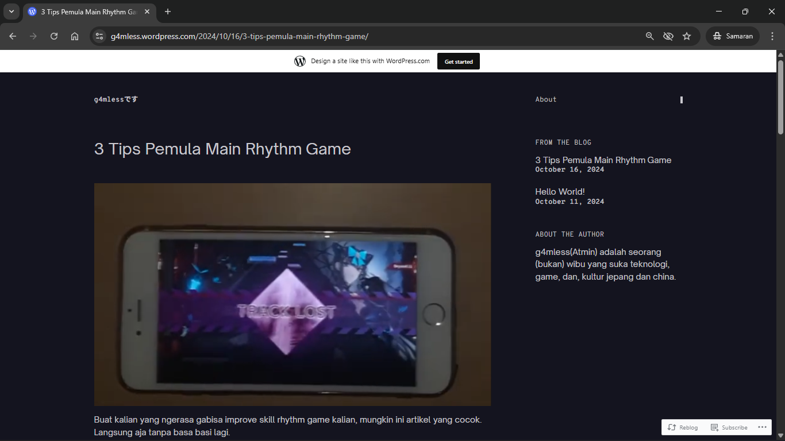

+++
date = '2025-09-21T09:58:41+07:00'
title = "Kenapa pake Hugo?"
draft = false
summary = "Bukan cuma ringan..."
tags = ["hugo", "blogging"]
+++
Sebelumnya, saya pernah mencoba membuat blog menggunakan WordPress. Namun, menurut saya WordPress kurang nyaman dipakai kalau kalian penikmat gratisan. Pilihan tema gratisnya terbatas, UI editornya kurang intuitif, dan versi gratisannya juga menampilkan watermark serta widget bawaan WordPress.

*Screenshot Halaman Wordpress g4mless.wordpress.com*

Saat itu saya udah malas buat nyobain wordpress lagi dan juga mengubur niat saya untuk blogging. Sampai akhirnya di hari saya mengetik artikel ini saya teringat ada framework yang sangat ringan yang cocok untuk blogging, yaitu Hugo.

Secara teknis, Hugo dibangun menggunakan bahasa pemrograman Go. Bahasa ini memang dirancang agar sederhana dan cepat, baik dari segi penggunaan sumber daya maupun penulisan kode. Hugo mewarisi sifat tersebut, sehingga hasilnya adalah generator situs statis yang **minimalis, cepat, dan mudah digunakan**.

## Keunggulan Hugo
Selain ringan dan cepat, Hugo juga memiliki beberapa keunggulan lain:  
- **Berbasis Markdown.** Semua konten berupa file markdown yang buat saya sendiri sebagai developer yang sudah biasa ngetik README.md tidak perlu mempelajari alat tambahan lagi dan dapat langsung diproses menjadi halaman HTML.  
- **Proses build yang singkat.** Semua berkat mesin dari Hugo sendiri yaitu Go-lang yang memang di desain untuk cepat. Tidak seperti Wordpress yang menggunakan PHP.
- **Fleksibel dalam hosting.** Karena output-nya berupa static files, Hugo bisa di-host secara gratis di GitHub Pages, Netlify, atau Vercel.
- **Banyak tema gratis.** Ada banyak pilihan tema open-source yang bisa saya katakan lebih bagus daripada tema gratis di wordpress. Di web ini sekarang saya sedang pakai tema github-styles, replika github yang cukup bagus untuk blog

## Kekurangan Hugo
Meskipun Hugo punya banyak kelebihan, ada beberapa hal yang bisa dianggap sebagai kekurangan:
- **Tidak cocok untuk orang awam.** Hugo lebih cocok untuk developer yang sudah berpengalaman daripada orang awam, karena Hugo tidak mempunyai UI khusus seperti wordpress yaitu dashboard ataupun editor. Kalian hanya bisa mengandalkan Code Editor seperti Visual Studio Code dan juga Git untuk kelola webnya.
- **Kurang cocok untuk project besar yang banyak interaksi.** Misalnya e-commerce atau aplikasi web interaktif. Untuk kasus seperti itu, CMS dinamis lebih cocok. 

## Penutup
Bagi saya, Hugo adalah pilihan yang tepat untuk memulai kembali aktivitas blogging. Karena saya sudah terbiasa menggunakan alat alat developer seperti Visual Studio Code, Git, dan juga Markdown.  
