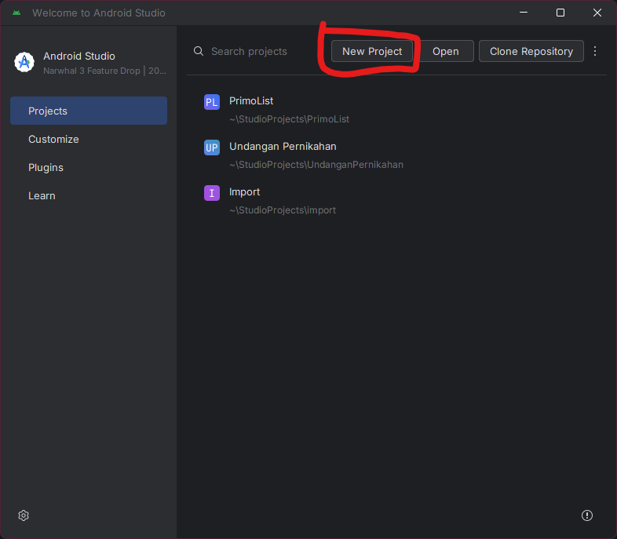
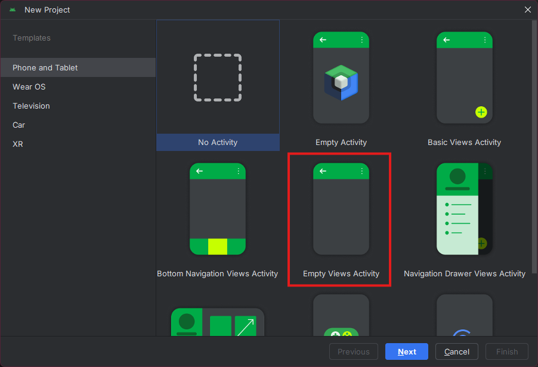
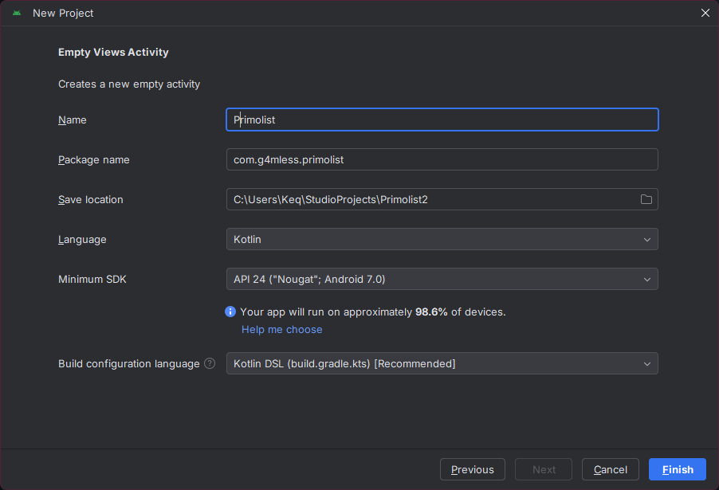
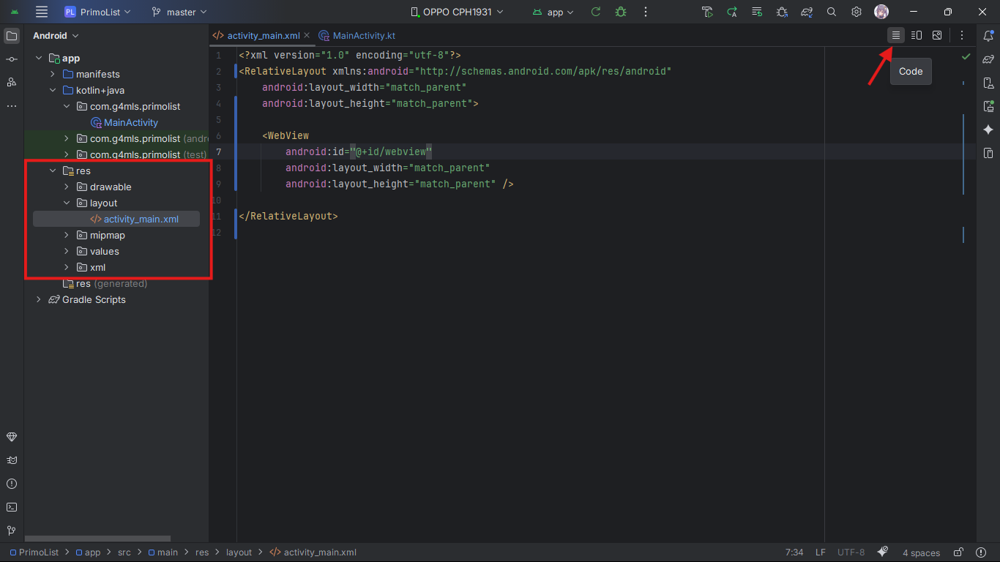
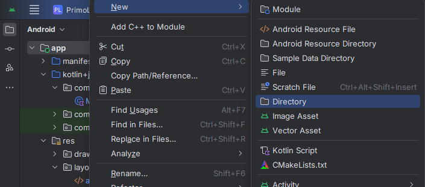
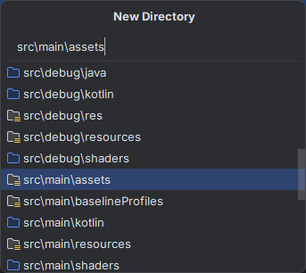
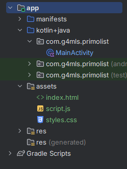
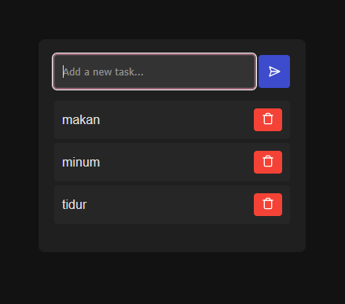
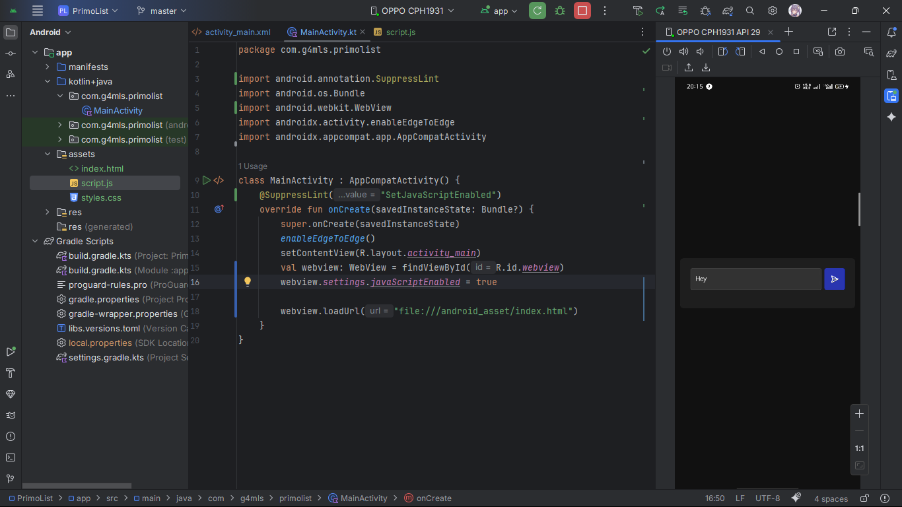
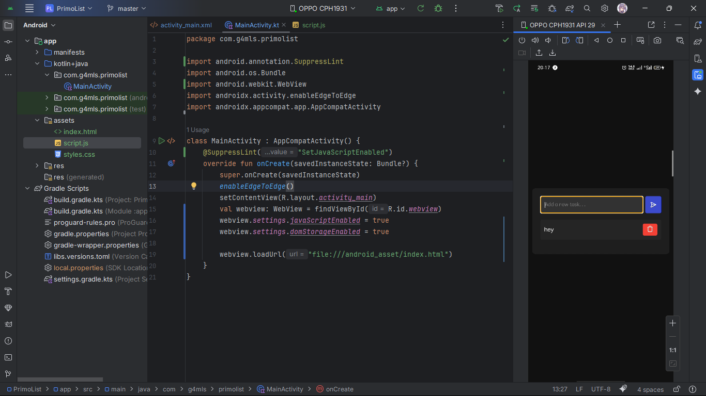

+++
date = '2025-09-22T20:28:49+07:00'
draft = false
title = 'Web statis jadi aplikasi android'
summary = 'cara termudah buat webdev pemula bikin aplikasi android.'
tags = ["dev", "tutorial", "android-dev"]
+++
Kalian baru aja bisa bikin aplikasi web simpel pakai html, css, dan javascript, terus kalian pengen bikin aplikasi web kalian jadi aplikasi Android 🤔. Tentunya bisa dengan komponen WebView yang ada di Android itu sendiri. Sebelum mengikuti tutorial ini, kalian seminimal mungkin paham dasar dari penggunaan android studio dan bahasa kotlin. Tanpa basa basi lagi mari kita ke tutorialnya
## 1. Bikin Project Baru
Klik tombol "New Project"

Lalu pilih "Empty Views Activity" (yang diberi kotak merah) dan klik Next

Terakhir kalian tinggal kasih nama aplikasinya dan klik Finish

Tunggu beberapa menit sampai proses sync project selesai, lalu kita bisa lanjut ke langkah selanjutnya.
## 2. Ubah Kode Layout
Setelah project tersinkronisasi, langkah selanjutnya kita mengubah kode layout yang ada di dalam folder ```res/layout/activity_main.xml```
Buka foldernya, lalu klik tombol "Code"(yang di garis panahi) untuk berpindah mode dari Design ke Code.



lalu ganti semua kodenya dengan kode ini
```xml
<?xml version="1.0" encoding="utf-8"?>
<RelativeLayout xmlns:android="http://schemas.android.com/apk/res/android"
    android:layout_width="match_parent"
    android:layout_height="match_parent">

    <WebView
        android:id="@+id/webview"
        android:layout_width="match_parent"
        android:layout_height="match_parent" />

</RelativeLayout>
```
kode diatas bertujuan untuk merubah view atau halaman di aplikasi android agar full menggunakan webview.
## 3. Menambahkan File Kode Web ke Project Aplikasi
Klik kanan di folder paling atas, yaitu ```app```, lalu pilih New dan pilih Directory



lalu pilih folder dengan nama ```src\main\assets``` di Gradle Source Sets.



setelah membuat folder ```assets``` kita tinggal masukkan file kode web milik kita.



disini atmin pakai project web lama pas masih belajar dasar. Webnya cuma Todo-list simpel menggunakan localStorage. (styles.css-nya minta generate sama AI awkakw)



## 4. Panggil index.html ke MainActivity
pertama kita perlu tambahkan import untuk webview di ```MainActivity```
```kotlin
import android.webkit.WebView
```
lalu kita tambahkan kodenya di dalam ```class MainActivity``` seperti ini
```kotlin
class MainActivity : AppCompatActivity() {
    @SuppressLint("SetJavaScriptEnabled")
    override fun onCreate(savedInstanceState: Bundle?) {
        super.onCreate(savedInstanceState)
        enableEdgeToEdge()
        setContentView(R.layout.activity_main)
        val webview: WebView = findViewById(R.id.webview)
        webview.settings.javaScriptEnabled = true

        webview.loadUrl("file:///android_asset/index.html")
    }
}
```
Sekarang kita tinggal run saja aplikasinya, baik itu menggunakan hp sendiri maupun emulator.



disini sudah terlihat webnya sudah jalan, tapi disini atmin gabisa tambah tugas ke dalam aplikasinya 🤔

setelah di cek lagi ternyata buat web todo-list punya atmin di kode webview-nya harus nyalain fitur yang atmin pake, yaitu localStorage. Untungnya cara fix-nya cukup tambahin kode ini dibawah ```webview.settings.javaScriptEnabled = true```
```kotlin
webview.settings.domStorageEnabled = true
```

Dan, web todo-list statis atmin sudah jadi .apk dan bisa digunakan selayaknya aplikasi android.


Terakhir kalian tinggal build .apk release-nya agar size file .apk bisa lebih kecil dari versi debug.